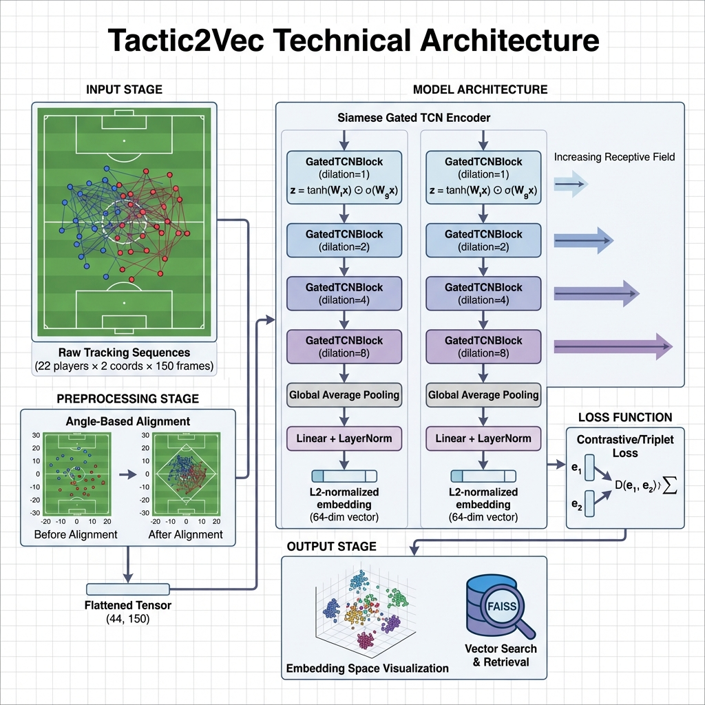

# Tactic2Vec: Deep Metric Learning for Similar Soccer Plays Retrieval


**Tactic2Vec** is a Deep Metric Learning system designed to measure the semantic similarity between 22-player football tracking sequences (scenes). It solves the problem of **play retrieval** by learning a dense vector representation where geometrically and tactically similar scenes (e.g., "counter-attack down the right flank" or "high press recovery") are close to each other in the embedding space.

## 🧠 Problem Formulation

Given a set of tracking sequences (scenes) $S = \{T_1, T_2, ..., T_N\}$, where each sequence (scene) $T_i \in \mathbb{R}^{22 \times 2 \times L}$ represents the $(x, y)$ coordinates of 22 players over $L$ frames, our objective is to learn an encoder function $f_\theta: S \rightarrow \mathbb{R}^d$ such that:

$$ D(f_\theta(T_i), f_\theta(T_j)) < D(f_\theta(T_i), f_\theta(T_k)) $$

## 📊 Dataset

The system is trained and evaluated on **FIFA World Cup 2022** tracking data provided by PFF FC.

The dataset is available at: https://www.blog.fc.pff.com/blog/pff-fc-release-2022-world-cup-data

## 🏗️ Framework Overview



### 1. Preprocessing
Raw tracking data is non-stationary and rotationally invariant. To learn meaningful patterns, we implement a rigorous **Alignment Pipeline**:
*   **Window Extraction**: Scenes are extracted as fixed-length temporal windows (**150 frames**, approx. 5 seconds) centered on key events (Shots, Passes).
*   **Angle-Based Canonicalization**: Each team player get assigned a number based on his angle relative to the team's center of mass

### 2. Model: Siamese Gated TCN
We utilize a **Siamese Network** architecture with a shared outcome-agnostic encoder.
*   **Backbone**: **Temporal Convolutional Network (TCN)**.
    *   Utilizes **Dilated Convolutions** to exponentially increase the Receptive Field without loss of resolution.
    *   **Gated Activation Units** (similar to WaveNet) to control information flow: $z = \tanh(W_{f,k} * x) \odot \sigma(W_{g,k} * x)$.
    *   **Residual Connections** for gradient stability.
*   **Input**: Flattened trajectory tensors of shape $(B, 44, L)$ (representing 22 players $\times$ 2 coords).
*   **Embedding Head**: Global Average Pooling followed by a Linear projection and LayerNorm to produce $L_2$-normalized embeddings of dimension $d=64$.


### 3. Inference & Retrieval
*   **Vectorization**: The trained encoder maps all indexed scenes to $\mathbb{R}^{64}$.
*   **Index**: We use **FAISS** (Facebook AI Similarity Search) with a Flat L2 index for exact nearest neighbor search.
*   **Dimensionality Reduction**: For PCA and t-SNE visualizations, we project the 64-dim manifold down to 2D/3D to inspect the embedding space.

**The Resulting 3D t-SNE Projected Embedding Space:**


## 💻 Tech Stack

*   **Deep Learning**: `PyTorch` (Custom `nn.Module` implementation of Siamese Gated TCN)
*   **Vector Search**: `faiss-cpu`
*   **Data Processing**: `numpy`, `pandas` 
*   **Visualization**: `matplotlib`, `plotly`

## 🚀 Quick Start

### Installation
```bash
pip install -r requirements.txt
```

### 1. Prep Stage
Extracts raw sequences (scenes), performs Angle-Based Alignment, and pickles them.
```bash
python src/pipeline.py prep --n_pairs 5000
```
*(Outputs: `aligned_scenes.pkl`, `training_pairs.pkl`)*

### 2. Indexing Stage
Generates embeddings using the pre-trained TCN weights.
```bash
python src/pipeline.py index --model_path siamese_tcn_attack.pth --input_scenes aligned_scenes.pkl
```
*(Outputs: `vectors.npy`)*

### 3. Analytical Search
Query the embedding space for a specific scene ID or random sample.
```bash
python search_tool.py --query_idx 100 --top_k 5 --output analysis.png
```

### 4. Manifold Visualization
project the high-dimensional embedding space into 3D.
```bash
python visualize_embeddings.py --plotly # Output: embedding_space_interactive.html
```

## 📖 CLI Usage

### `pipeline.py` - Data Preparation & Indexing

The main pipeline orchestrator with two subcommands: `prep` and `index`.

#### **Subcommand: `prep`**
Extracts scenes from raw tracking data, performs angle-based alignment, and generates training pairs.

```bash
python src/pipeline.py prep [OPTIONS]
```

**Arguments:**
- `--limit_games <int>` - Limit number of games to process (optional, processes all games if not specified)
- `--n_pairs <int>` - Number of training pairs to generate (default: `1000`)
- `--output_scenes <path>` - Output path for aligned scenes (default: `aligned_scenes.pkl`)
- `--output_pairs <path>` - Output path for training pairs (default: `training_pairs.pkl`)

**Example:**
```bash
# Process all games and generate 5000 training pairs
python src/pipeline.py prep --n_pairs 5000

# Process only 10 games with custom output paths
python src/pipeline.py prep --limit_games 10 --output_scenes data/scenes.pkl --output_pairs data/pairs.pkl
```

**Outputs:**
- `aligned_scenes.pkl` - Pickle file containing all aligned scene arrays
- `training_pairs.pkl` - Pickle file containing training pairs for metric learning

---

#### **Subcommand: `index`**
Generates embeddings using the trained model and prepares vectors for search.

```bash
python src/pipeline.py index --model_path <path> --input_scenes <path> [OPTIONS]
```

**Arguments:**
- `--model_path <path>` - **[Required]** Path to trained PyTorch model (.pth file)
- `--input_scenes <path>` - **[Required]** Path to aligned scenes pickle file
- `--output_index <path>` - Output path for generated vectors (default: `vectors.npy`)

**Example:**
```bash
# Generate embeddings using pre-trained model
python src/pipeline.py index \
  --model_path siamese_tcn_attack.pth \
  --input_scenes aligned_scenes.pkl \
  --output_index vectors.npy
```

**Outputs:**
- `vectors.npy` - NumPy array of shape `(N, 64)` containing L2-normalized embeddings

---

### `search_tool.py` - Tactical Play Search & Visualization

Search for similar plays and visualize results with raw trajectory overlays.

```bash
python search_tool.py [OPTIONS]
```

**Arguments:**
- `--query_idx <int>` - Index of the scene to use as query (default: random selection)
- `--top_k <int>` - Number of similar plays to retrieve (default: `1`)
- `--model <path>` - Path to model weights (default: `siamese_tcn_attack.pth`)
- `--scenes <path>` - Path to aligned scenes pickle file (default: `aligned_scenes.pkl`)
- `--vectors <path>` - Path to pre-computed vectors for faster search (default: `vectors.npy`)
- `--output <path>` - Output filename for visualization (default: `search_results.png`)
- `--no_vis` - Disable visualization and only print search results (flag)

**Examples:**
```bash
# Random query with top 5 matches
python search_tool.py --top_k 5

# Specific scene query
python search_tool.py --query_idx 100 --top_k 3 --output my_results.png

# Search without visualization
python search_tool.py --query_idx 50 --top_k 10 --no_vis
```

**Outputs:**
- `search_results.png` - Visualization showing query scene and top-K matches with trajectory overlays
- Console output with similarity scores and event metadata
